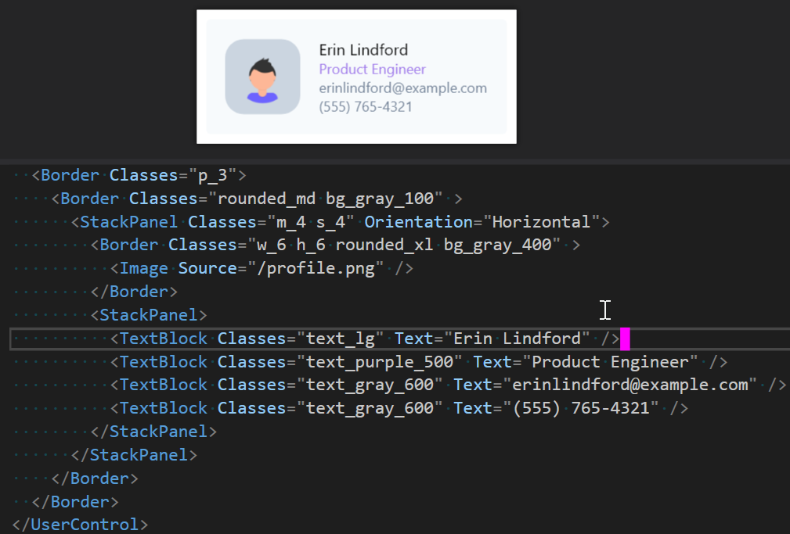

# README
This is repository contains an experimental Extension to [AvaloniaUI](https://github.com/AvaloniaUI/Avalonia/) that tests the feasibility of implementing a utility-first css framework like [tailwindcss](https://tailwindcss.com/) for AvaloniaUI.

## What does that mean?
To style controls you just some of the classes that are pre-generated by the framework. Scroll down for some examples.

## Examples

### Buttons
#### Simple Win10 like button

### Misc
#### User Card

### Alerts
#### Classic

#### Danger

#### Modern

#### Warning

## Getting started
It's a prototype.
You clone the repo and start the example app.

### Questions

#### How does it work?
A ton of style permutations are automatically generated and added to the resources of the application.

As soon as you add a class, the associated setter is applied.

The names of the classes follow easy to remember patterns and they restrict your choices just enough to get a consistent look without while still being flexible.

#### Why would you want to do this?
Because tailwindcss hits the sweetspot between flexibility and productivity that I am missing when developing native applications.

#### How can I learn more?
If you haven't checked out tailwindcss yet, I encourage you to take a look and use it for your next SPA or website. Take a look at their great website at https://tailwindcss.com.

#### Is this a good idea?
I am not sure yet. It's a prototype.